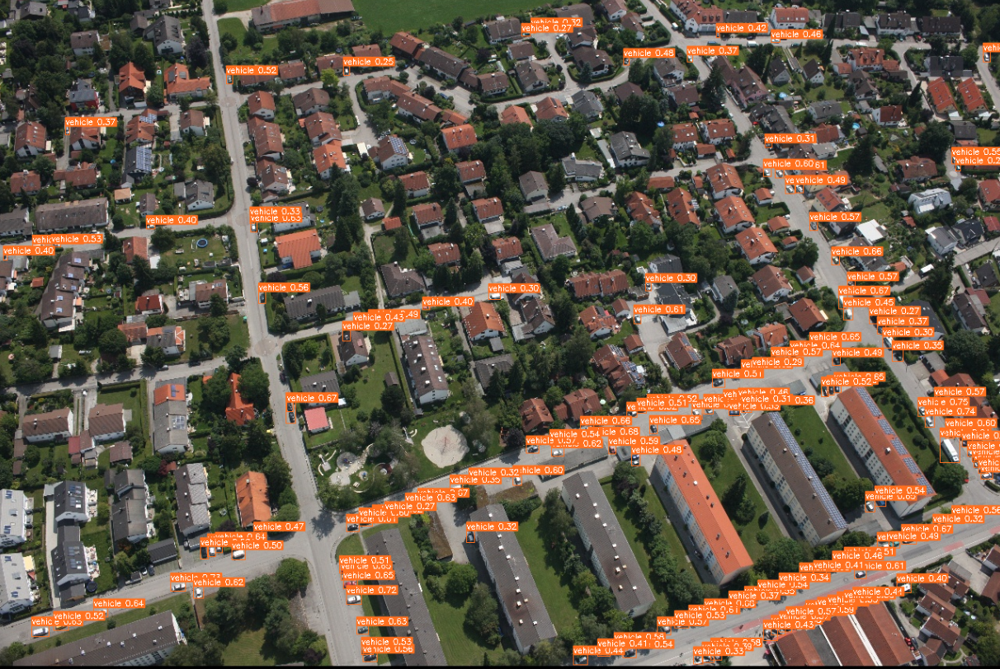

# Yolo_Small_Object_Detection

## 專案概述
本專案針對空拍影像中的小物件偵測進行優化，特別專注於交通工具的識別與分類。此研究為中興大學114-2學期研究方法課程實作，由中研院廖弘源所長（YOLOv7發表者）指導。

*偵測結果示例圖*

## 問題定義
空拍影像中的小物件辨識具有高難度，本研究專注於提高以下三類交通工具的偵測效能：
1. 車輛
2. 航空工具
3. 船隻

## 改進方法

### 網路架構優化
- 調整YOLOv7網路層結構，引入P2層並刪除P4、P5層
- 重新設計模型注意力機制，使其更專注於小尺寸物件特徵
- 透過架構調整提高小物件的特徵提取能力

### 資料增強策略
- 整合額外資料集（Xviews）擴充訓練樣本
- 針對小物件進行特定的資料增強處理

### 技術創新點

#### 方法一：SAHI整合與修改
- 導入SAHI（Slicing Aided Hyper Inference）技術，實現滑動窗口切割
- 對原本專為YOLOv8設計的開源套件進行修改，使其適用於YOLOv7架構
- 通過多次局部掃描提高小物件的檢測率

#### 方法二：模型融合
- 將SAHI模型與原始YOLOv7模型預測結果進行融合
- 設計權重分配策略，整合兩個模型的優勢
- 降低單一模型的局限性，提高整體檢測準確度

#### 方法三：二階段分類優化
- 對初步檢測到的物體進行裁剪
- 將裁剪影像送入專門的CNN分類模型進行二次確認
- 透過兩階段策略顯著提升模型辨識準確度

## 實驗結果
詳細的實驗結果、效能評估與比較可參考 [result.pdf](result.pdf)

## 參考其他repo
https://github.com/WongKinYiu/yolov7
https://github.com/kadirnar/Yolov7-SAHI